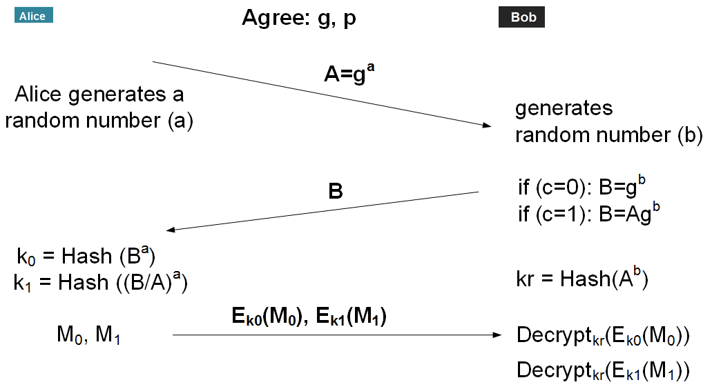

# Oblivious Transfer 

## 1-out-of-2

✅ AI/ML Use Case Scenario:
Alice owns a model and produces two possible outputs (e.g., prediction for disease A and prediction for disease B).

Bob wants only 1 of these outputs privately.

Using 1-out-of-2 Oblivious Transfer, Bob decrypts only 1 result, and Alice doesn't know which.

🧪 Example Run:
- Alice generates predictions:
	- m0 = "Disease A risk 10%"
	- m1 = "Disease B risk 72%"
- Bob inputs 1 → only gets prediction for Disease B.
- Alice never learns Bob's choice.

🧠 Future Enhancements:
Scale to 1-out-of-n OT (more than two outputs).

Integrate this into a secure inference service using Flask + PyTorch/TF.

Add ZK Proofs to verify the query was valid (optional, for higher security).

## 1-out-of-N

Scaling to 1-out-of-n Oblivious Transfer (OT) means Bob can privately choose one of many model outputs (e.g., $$/ 𝑚_0 , 𝑚_1 , … , 𝑚_{𝑛 − 1}​ /$$ ), and learn only that one, without Alice knowing which, and without Bob learning the others.

🔐 Approach: 1-out-of-n OT via Diffie-Hellman-style keys
Extend the current OT scheme by using:
- A shared group with prime modulus p and generator g.
- Alice computes and encrypts all n messages, using unique symmetric keys that depend on her secret and Bob's input.
- Bob can compute the decryption key for only one message index 𝑖.

## ⚙️ Key Idea: 
Simulate a simplified version of 1-out-of-n OT: 
- Bob sends 𝑇 = $$/ 𝑔^𝑟 ⋅ ℎ_𝑖 /$$ ​ where $$/ ℎ_𝑖 = 𝑔^{𝑘_𝑖} /$$ ​ for a public list of values generated by Alice. 
- Alice encrypts $$/  𝑚_𝑖 ​ /$$ with key derived from $$/ 𝑇^𝑎 /$$. 
- Bob computes $$/ ( 𝑔^𝑟 ) ^𝑎 = 𝑔 ^{𝑎𝑟} /$$  and recovers key only for the index he selected. This version assumes a semi-honest model (no malicious actors).

| Role      | Action                                                           |
| --------- | ---------------------------------------------------------------- |
| **Alice** | Encrypts all model outputs using unique keys                     |
| **Bob**   | Privately chooses one index, constructs a smart public value $T$ |
| **Alice** | Encrypts messages using derived keys from $T$                    |
| **Bob**   | Decrypts only his selected message using shared secret $g^{ar}$  |

🧪 Applications:
Privacy-preserving model APIs (e.g. only 1 feature/prediction retrieved)

Federated learning where clients selectively pull model updates

Secure inference in healthcare and finance

